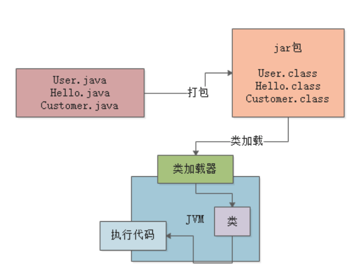

# JVM实战高手

## 类加载器

JVM 想要执行一个类，首先要加载类，在加载类之前，需要先编译成字节码class 文件。 然后就执行类的加载过程，JVM 加载类的话，需要类加载器

类加载器是分层级的，遵循双亲委派机制

+ Bootstrap ClassLoder，加载java的核心类库，加载java安装目录下的lib目录的class文件
+ Ext ClassLoder，加载一些java的其他类库，加载java安装目录下的lib/ext目录下的class
+ Application ClassLoder ，应该程序类加载器，这个类加载器是加载我们写的类
+ 自定义类加载器
  类加载器遵循双亲委派机制，就是说，如果要加载一个类，先去为他的父类能不能加载，如果父类上面还有父类，就继续问，直到顶层。然后顶层说加载不了，就下派到子类，如果所有父类都加载不了，那就自己加载。这么做的好处是，不会重复加载一个类
  然后说一下类加载的过程，分这么几步，加载，验证，准备，解析，初始化。 
  加载的话，就是刚才说的类加载器去加载类
  验证阶段，主要是验证加载的字节码是否符合JVM规范，不然随便瞎写JVM也执行不了
  准备阶段，主要是给对象申请内存，然后给变量设置初始值，该设置0的设置0，该设置null的设置null
  解析阶段，主要是给符号引用变成直接引用，就是把一些变量什么temp，直接换成物理地址，不然执行的时候JVM也不认识temp是啥
  初始化阶段：主要是给变量赋值，准备阶段只是设置了初始值，这个是核心阶段，执行类的初始化，如果发现这个类的父类没有初始化，会先暂停，然后去初始化父类，也是走类加载的一套流程，直到父类加载完了，再执行子类的初始化
  

