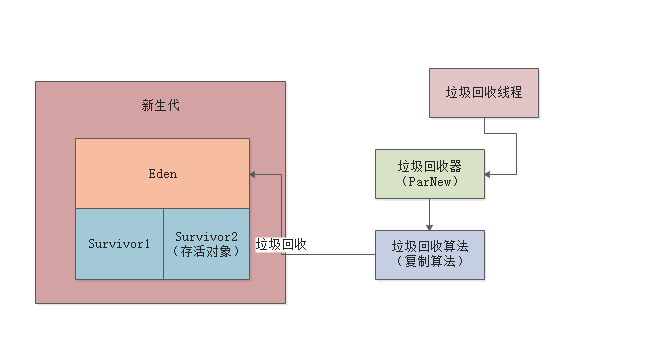

# JVM实战高手


## 1. 类加载

### 1.1 类加载器

JVM 想要执行一个类，首先要加载类，在加载类之前，需要先编译成字节码class 文件。 然后就执行类的加载过程，JVM 加载类的话，需要类加载器


### 1.2 类加载过程

类加载的过程加载，验证，准备，解析，初始化。 

+ 加载: 类加载器去加载类
+ 验证: 主要是验证加载的字节码是否符合JVM规范，不然随便瞎写JVM也执行不了
+ 准备: 给对象申请内存，然后给变量设置初始值，该设置0的设置0，该设置null的设置null
+ 解析: 给符号引用变成直接引用
+ 初始化：
  + 给变量赋值，准备阶段只是设置了初始值.
  + 这个是核心阶段，执行类的初始化，如果发现这个类的父类没有初始化，会先暂停，然后去初始化父类

```java
public class Kafka {
	public static void main() {
		ReplicaManager rm = new RplicaManage();
	}
}
```


### 1.3 双亲委托机制

类加载器是分层级的，遵循双亲委派机制

+ Bootstrap ClassLoder，加载java的核心类库，加载java安装目录下的lib目录的class文件
+ Ext ClassLoder，加载一些java的其他类库，加载java安装目录下的lib/ext目录下的class
+ Application ClassLoder ，应该程序类加载器，这个类加载器是加载我们写的类
+ 自定义类加载器


类加载器遵循双亲委派机制，就是说，如果要加载一个类，先去为他的父类能不能加载，如果父类上面还有父类，就继续问，直到顶层。然后顶层说加载不了，就下派到子类，如果所有父类都加载不了，那就自己加载。这么做的好处是，不会重复加载一个类


### 1.4 Tomcat的类加载机制

+ Tomcat 自定义了Common，Catalina,  Shared 等类加载器，加载自己的核心内库，使用线程上下文加载器打破双亲机制

  ```
  Thread.currentThread().setContextClassLoader(catalinaLoader)
  ```

+ 每个webapp有一个对应的webapp类加载器

+ 每个jsp准备一个jsp类加载器


我们自己打包的war中的class 不会传到的上层类加载器中


## 2. JVM内存模型

**方法区**（jdk1.8以后，这块区域叫元数据空间）：存放类似常量池的东西和各种类相关的信息

**程序计数器(Program Counter)**：记录当前执行的字节码指令的位置，**多线程每个线程有自己的程序计数器**

**Java虚拟机栈(Stack)**：存放方法创建时的栈帧，栈帧有方法的**局部变量表、操作数栈、动态链接、方法出口**等， **每个线程有自己的虚拟机栈**

**堆内存(Heap)**：存放代码创建的各种对象

**本地方法栈(Native Method Stack)**：存放各种native方法的局部变量表之类的信息


```java
public class Kafka {
	public static void main() {
		ReplicaManager rm = new RplicaManage();
    rm.loadReplicasFromDisk();
	}
}


public class ReplicaManager {
 	public void loadReplicasFromDisk() {
    	Boolean hasFinished = false;
      if (isLocalDataCorrupt()) {}
  }
  
  public Boolean isLocalDataCorrupt() {
  	return isCorrupt;  
  }
}
```


## 3. 什么是垃圾回收

后台自动运行的线程，不断检查jvm堆中各个实例对象


如果某个实例对象没有被任何一个方法的局部变量，类的静态变量，常量引用，那个这个对象实列就应该被回收掉，让他不再占用任何资源。JVM中的垃圾会被定期的后台垃圾回收线程清理掉，不断释放


## 4. 内存分区

### 4.1 内存区域

```java
public class Kafka {
  
  private static ReplicaFetcher fetcher = new FeplicatFetcher();
  
	public static void main() {
		loadReplicasFromDisk();
	}


 	public static void loadReplicasFromDisk() {
      ReplicaManager replica = new ReplicaManager();
    	replica.load();
  }
  
  public static void fetchReplicaFromRemote() {
  	fetcher.fetch():
  }
}
```


+ 静态变量fetcher 长期存在
+ loadReplicasFromDisk 执行完，replicaManger就会回收。

**老年代**：长期存在

**年轻代**：大部分对象存活时间短，先放在年轻代

**永久代**：存放类信息


**Young GC**: ReplicaManager没有引用的时候不会立即回收，如果新生代预先分配的内存空间被对象占满，会发生新生代的垃圾回收。腾出内存空间


当对象躲过多次垃圾回收，默认15次以后，replicaFetcher 从新生代转移到老年代。如果老年代满了，也会进行来及回收


### 4.2 内存参数设置

**-Xms**和**-Xmx**分别为堆内存大小已经允许堆内存扩张到的最大内存大小，一般这两个参数会设置成一样大

**-Xmn**为堆内存中新生代的大小，堆内存中扣除了新生代大小就剩老年代了。

**-XX:PermSize****和**-XX:MaxPermSize**分别表示永久代的内存大小以及永久代允许扩张的最大内存，一般这两个参数也会设置成一样的大小。在JDK1.8时，不光方法区的名称从方法区变成了Metaspace元数据空间，这两个参数也相应的变成了**-XX:Metaspace**和**-XX:MaxMetaspace**。


### 4.3 支付系统内存设置


支付系统业务场景非常复杂，就最核心的支付流程如下图，每当用户发起一个支付请求时，都会发送到商城中，商城此时会将支付请求转交给支付系统，此时支付系统内会生成一个支付订单对象，此时会流转回用户方选择支付方式，当支付系统接收到用户选择的支付方式后转交给第三方支付渠道支付，并将支付结果返回给支付系统。

其中压力最大的就是，**一天之内要处理百万级别的订单量，就JVM角度说就是每天会有百万个对象在堆内存中创建和销毁。**

+ 需要几台机器
+ 每台机器内存多大
+ 每台机器JVM内存多大才能保证这样打的内存开销。


#### 4.3.1 堆内存设置


```java
public class Payorder {
	private Integer userId;
	private Long orderTime;
	private Integer orderId;
}
```


每台机器，大概是一秒钟接收到30个订单的请求，然后在JVM的新生代中创建出来，一秒钟后处理完毕，就会被GC了。


一般一个对象占内存大小分两部分，对象本身的一些信息，如64位**linus上对象头占16字节**，**对象实力变量Integer占4字节、Long占8字节**，再根据其他类型计算就差不多了，**一般支付系统核心类按20个实例变量计**算，一般一个对象几百字节，姑且大一点500字节内存空间，**0.5kb**也不算大。


按如上文分析，**如果按每台机器30个订单对象的分析，那也只不过是30*0.5=15kb的内存占用**，其实是很小的。随着系统的运行，新生代中的订单对象越来越多，知道某一刻达到了内存的阈值，启动Minor GC，将对象回收，依次往复。

因为此时分析的是最核心的支付流程，在订单创建的过程当中**肯定包含其他数十种对象的创建，不妨将数量级扩大10~20倍，一秒的内存占用量也就几百kb~1MB之间**。


一般的服务器有两种常见规格，2核4G和4核8G的。假设此时用2核4G的，服务器本身差不多要占2G空间，**剩下的2G需要分配给方法区、栈内存和堆内存**，此时**堆内存差不多能分到1G内存**，但是堆内存中的老年代至少也需要几百M空间，所以剩下给新生代的空间也就剩下几百M了，根据完整的支付系统估算，**一秒需要占用1M新生代内存空间，所以此时差不多几百秒几分钟就会GC一次**，而频繁的GC对系统的稳定性总是不好的。


可以考虑购买8G的机器，分配4G给JVM， 这样将近1个小时才会触发Minor GC， 降低了GC的频率。**-Xms和-Xmx设置为3G，-Xmn设置为2G。**


反面案例，新生代和老年代瞬间被占满，新生代频繁GC，老年代频繁GC并且垃圾回收速度慢，极大影响性能。


#### 4.3.2 永久代和栈内存

老年代一般**几百MB**，栈内存一般**512kb到1MB**


## 5. 垃圾回收详解

### 5.1 垃圾回收对象

JVM 使用可达性分析算法来判断哪些对象可以被回收。分析谁在引用，是否有一个**GC Roots**

**方法的局部变量**和**静态变量**都是一种GC Roots


### 5.2 引用类型

#### 强引用

强引用就是一个变量引用一个对象；该被引用的堆中的对象，宁可报OutOfMemoryError错误，也都不会被回收。

```java
public class Kafka {
  private static ReplicaFetcher fetcher = new FeplicatFetcher();
}
```


#### 软引用

软引用，在java中就是被SoftReference包裹起来的对象；只有内存不够了，才会被回收。

```java
public class Kafka {
  private static SoftReference<ReplicaFetcher> fetcher = new SoftReference<ReplicaFetcher>(new FeplicatFetcher());
}
```


#### 弱引用

弱引用的的表达形式和软应用类似，就是通过WeakReference包裹起来的对象；弱引用的效果几乎和没引用差不多，所以只要垃圾回收，它就会被回收。

```java
public class Kafka {
  private static WeakReference<ReplicaFetcher> fetcher = new WeakReference<ReplicaFetcher>(new FeplicatFetcher());
}
```


### 5.3 垃圾回收算法

#### 5.3.1 标记算法


**老年代垃圾回收算法**，标记垃圾对象，保留存活对象，造成大量的内存碎片，可能导致**没有足够的内存空间来分配新的对象**


#### 5.3.2 复制算法


**新生代垃圾回收算法**，标记垃圾对象，一次性吧原来内存区域清空，避免了内存碎片。**只有一半内存可用，使用效率低**

**算法优化**


新生中的内存比例从等额的两份调整为 **Eden:Survivor:Survivor=8:1:1**的三部分，每次只使用Eden和其中一个Survivor区，当它们都占满了时触发Minor GC，将Eden和其中一个Survivor区的存活对象都迁移到另外一个Survivor区中,此时另外一个Survivor开始被闲置直到下一次Minor GC和另外一个Survivor交换。

**始终保持一块survivor是空的**，循环使用三块内存区域，**只有10%的内存空间是闲置的**

经过15次GC以后，新生代对象进入老年代 **-XX:MaxTenuringThreshold=15** 


### 5.4 对象年龄判断

#### 5.4.1 动态年龄规则

如果一批对象的总和大于survivor区域的50%，那么此时触发动态年龄判断

如果年龄1 + 年龄2 + 年龄n的对象总和超过了survivor区域的50%，**会把年龄n以上的对象放入老年代**


#### 5.4.2 大对象直接进入老年代

**-XX:PretenureSizeThreshold** 设置大对象，1048576就是1MB


#### 5.4.3 MinorGC后对象太多无法放入Survivor

如果发现对象超过survivor中的一个区，无法放入，直接进入老年代


### 5.5 垃圾回收器类型

**Serial/SerialOld**: 分别用于新生代和老年代，垃圾回收时工作现场卡住

**ParNew/CMS**: 新生代和老年代的多线程并发

**G1**: 统一新生代和老年代，更加优秀的算法


### 5.6 STOP WORLD 问题



标记Eden里面的垃圾对象，一次性清理Eden和Survivor内存空间。这时候不允许在Eden中创建对象。进入“**STOP THE WORLD**”


垃圾回收完毕，代码才可以继续运行


### 5.7 新生代进入老年代详细过程

阶段一, Eden 区域满了，检查**新生代所有对象是否大于老年代**

+ 如果小于，进行Minor GC
+ 如果大于，进入阶段二

阶段二，查看**-XX:-HandlePromotionFailure** 是否设置

+ 如果没有设置或者大于，进行FullGC
+ 如果设置，进入阶段三

阶段三，**判断老年代空间是否大于MinorGC后进入老年代平均大小**

+ 如果大于，MinorGC
+ 如果小于，FullGC


## 6. 案列分析：Survivor内存优化


每次计算10秒，每分钟100次计算，每次任务产生10MB左右对象，一分钟后eden就基本满了

**第一**，**看看老年代可用空间是否大于新生代全部对象**，老年代1.5GB可用，新生代1.2GB可用，那么直接MinorGC。

每个任务10秒，80个计算任务结束，还有20个计算任务总公共200MB对象存活。


200MB的对象不能放入survior区，因为每块survivor区域只有100MB空间，200MB对象会直接进入老年代


第三次MinorGC 以后，老年代只有1.1G，是放不下1.2G对象的

**第二，-XX:-HandlePromotionFailure 参数被打开，看看老年代可用空间是否大于历次 Minor GC过后进入老年代对象大小**

足够，所以进行Minor GC。**如果参数关闭或者担保失败，可能提前触发Full GC**


**7分钟后，老年代空间不够，触发Full GC**


**优化方案**：**增加Survivor区域大小**或者**修改-XX:SurvivorRatio=8 这个参数**， 避免对象直接进入老年代


## 7. ParNew垃圾回收器


**新生代多线程**垃圾回收, **-XX:+UseParNewGC** 开启ParNew垃圾回收器

默认垃圾回收线程数和CPU核树一样, **-XX:ParallelGCThreads**指定线程数量

新生代标记的时候需要STOP THE WORLD，**标记处GC Root的少量存活对象**，移动到一个survivor区域，清空eden和另一个survivor


如果程序运行在**单核CPU，建议采用Serial**垃圾回收期来**减少上下文切换**


## 8. CMS垃圾回收器


**阶段一**：**初始标记**，进入STOP THE WORLD状态，速度较快，**只标记GC Root直接引用的对象**


**阶段二**：**并发标记**，工作线程可以随意创建新的对象。**对GC Root追踪，那些对象被GC Root间接引用**，最耗时


**阶段三：重新标记**，再次进入STOP THE WORLD，**对老年代说有对象进行GC Roots追踪**， 只对阶段二中变动的少数对象进行标记


**阶段四：并发清理**，这个阶段最耗时，但是不影响系统执行


在并发标记和并发清理时最耗时，垃圾回收线程和工作线程同时运行，导致CPU资源被垃圾回收线程占用一部分，CMS默认启动垃圾回收的线程数量是 **(CPU核数 + 3)/4**


当并发清理的时候，新生代有对象进入老年代变成**”浮动对象“**而并不被清理，这时候需要保证**老年代有一定预留空间。-XX:CMSInitiatingOccupancyFraction**来设置老年代占用比例。JDK1.6默认是92%。**如果大于，会自动进FullGC**


如果CMS垃圾回收期间，程序要放入老年代的对象大于可用空间，**发生Concurrent Mode Failure**


**如果发生Concurrent Mode Failure, 会自动启用 SerialOld来代替CMS**，STOP THE WORLD，重新对GC Roots追踪，并标记全部垃圾对象，不允许产生新的对象。


**-XX:+UseCMSCompactAfFullCollection 默认开启**，在FullGC结束以后，再次进入STOP THE WOLRD，停止工作线程，进行碎片整理，避免内存碎片**。-XX:CMSFullGCsBeforeCompaction，执行多少次Full GC之后再次执行一个内存碎片整理**。

**老年代的垃圾回收币新生代慢10倍以上**


## 9. 案列分析：ParNew和CMS参数

### 9.1 新生代参数

JVM 4G，分配给堆内存3G，每个线程1M，几百个线程就几百M，永久代256M

1秒产生60MB，新生代1.5G，Eden1.2G的话20秒占满。存活对象150MB，那么survivor需要大于150M。调整新生代为2G，老年代1G，Eden1.6G， Survivor200MB。**避免新生代跳过survivor直接进入老年代**

降低停留在新生代的时间到5次，结合系统运行模型考虑。指定大对象进入老年代和指定垃圾回收器

```bash
-Xms3072M Xmx3072M Xmn2048M Xss1M  –XX:PermSize=256M –XX:MaxPermSize=256M 
–XX:SurvivorRatio=8  –XX:MaxTenuringThreshold=5  –XX:PretenureSizeThreshold=1M 
```


### 9.2 老年代参数设置

-XX:-HandlePromotionFailure 在1.6以后废弃了，直接进入检查**老年代可用空间是否大于MinorGC后进入老年代的平均对象大小**

计算第一次FullGC时机，过了高峰期，没有必要调整–XX:CMSInitiatingOccupancyFraction

大对象很少设置，可以直接放入老年代，**避免在新生代频繁创建销毁**

**并在FullGC以后进行内存整理**

```bash
-Xms3072M Xmx3072M Xmn2048M Xss1M  –XX:PermSize=256M –XX:MaxPermSize=256M 
–XX:SurvivorRatio=8  –XX:MaxTenuringThreshold=5  –XX:PretenureSizeThreshold=1M 
–XX:CMSInitiatingOccupancyFraction=92
–XX:+UseCMSCompactAtFullCollection  –XX:CMSFullGCsBeforeCompaction=0
```

**注意**：新生代存活对象少，minor GC快，老年代存活对象多，full GC慢


## 10. G1垃圾回收器


把堆分成大小相等的region，老年代和新生代只是逻辑是哪个的概念


设置垃圾回收的预期停顿时间，比如1小时内G1垃圾回收的STOP THE WORLD不能超过一分钟。G1对每个region追踪**回收价值**


G1追踪，1个Region中有10MB的垃圾对象，回收需要1s, 另一个Region中有20MB的垃圾对象，回收需要200ms。G1回收20MB的垃圾对象。


 

Region是可以转化的，在垃圾回收以后，Region可能转为新生代，也可能分配给老年代。


**-XX:+UseG1GC** 开启G1垃圾回收器，Region的大小是堆大小除以2048，比如堆大小是4G，那么每个region是2MB。也可以用**-XX:G1SHeapRegionSize** 来指定大小


刚开始，**新生代只占堆内存5%，可以通过-XX:G1NewSizePercent**来设置新生代占比

JVM会不停给新生代更多region，但是不**会超过60%，可以用过-XX:G1MaxNewSizePercen**t指定


加入新生代有100个region，那么80个region是eden，两个survivor各占10个region

新生代eden快满的时候，就会触发垃圾回收，可以用 **-XX:MaxGCPauseMills 来指定G1执行GC最多可以让系统停顿多久**


G1 有专门的区域来存放大对象，可能跨region，在新生代和老年代回收的时候，顺便回收大对象


### 10.1 垃圾回收过程

新生代回收采用**复制算法**


**新生代+老年代混合回收**

-XX:InitiatingHeapOccupancyPercent 是45%， 如果老年代占用堆内存45%的时候，会触发一个新生代+老年代的混合回收


**初始标记**

标记GC Root直接引用的对象, STOP THE WORLD


**并发标记**

从GC Root开始追踪所有存活的对象, 比如replicaFetcher 对象被GC Root对象间接关联，所有标记为存活


```java
public class Kafa {
	public static ReplicaManager replicaManager = new ReplicaManager();
}

publc class ReplicaManager {
	public ReplicaFetcher replicaFetcher = new ReplicaFetcher();
}
```


**最终标记**

进入STOP THE WORLD, 标记存活和垃圾对象


**混合回收**

同时回收老年代，新生代，大对象。G1允许混合回收阶段执行多次混合回收。停止工作，执行一次混合回收，恢复工作，然后再次停止进行混合回收。可以用 **-XX:G1MixedGCCountTarget 设置，默认8次**


### 10.2 参数设置

**-XX:G1HeapWasterPercent 默认是5%**，一旦空闲出来的R**egion数量达到堆内存的5%**，就会停止本次混合回收

**-XX:G1MixedGCLiveThresholdPercent默认是85%**，存活对象低于85%的region才会进行回收。 

如果G1GC失败，会进行单线程垃圾回收


## 11. 案列分析：G1参数


用户集中在晚上两三个小时，60W活跃用户，每个小时20W用户。一个小时内1200W次操作，3000/s。一般需要5台4核8G的机器来抗压，差不多600请求每台机器每秒。

**一次请求5kb，那么一秒产生600个请求，占用3MB的内存**

```bash
-Xms4096M -Xmx4096M -Xss1M -XX:PermSize=256M -XX:MaxPermSize=256PM -XX:+UseG1GC
```

-XX:G1NewSizePercent 保持默认, -XX:G1MaxNewSizePercent 保持默认

G1会分配多少个Region给新生代，多久触发一次新生代的gc, 每次多长时间无法提前预知。


**-XX:MaxGCPauseMills** 要根据实际情况，如果过小，频繁触犯minor gc, 如果过大，停顿时候影响系统性能。