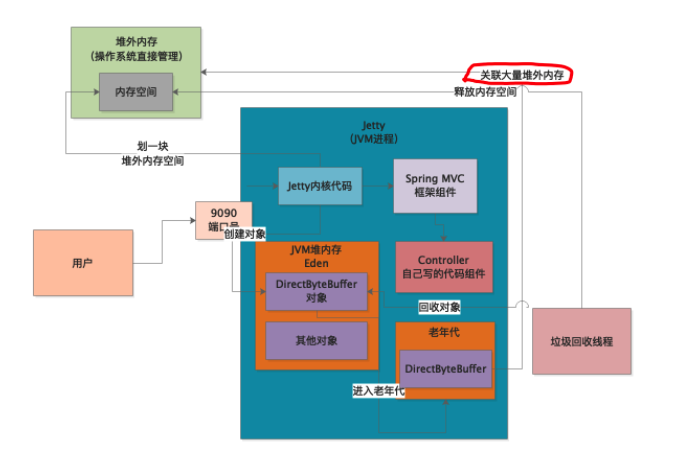

# JVM实战高手


## 1. 类加载

### 1.1 类加载器

JVM 想要执行一个类，首先要加载类，在加载类之前，需要先编译成字节码class 文件。 然后就执行类的加载过程，JVM 加载类的话，需要类加载器


### 1.2 类加载过程

类加载的过程加载，验证，准备，解析，初始化。 

+ 加载: 类加载器去加载类
+ 验证: 主要是验证加载的字节码是否符合JVM规范，不然随便瞎写JVM也执行不了
+ 准备: 给对象申请内存，然后给变量设置初始值，该设置0的设置0，该设置null的设置null
+ 解析: 给符号引用变成直接引用
+ 初始化：
  + 给变量赋值，准备阶段只是设置了初始值.
  + 这个是核心阶段，执行类的初始化，如果发现这个类的父类没有初始化，会先暂停，然后去初始化父类

```java
public class Kafka {
	public static void main() {
		ReplicaManager rm = new RplicaManage();
	}
}
```


### 1.3 双亲委托机制

类加载器是分层级的，遵循双亲委派机制

+ Bootstrap ClassLoder，加载java的核心类库，加载java安装目录下的lib目录的class文件
+ Ext ClassLoder，加载一些java的其他类库，加载java安装目录下的lib/ext目录下的class
+ Application ClassLoder ，应该程序类加载器，这个类加载器是加载我们写的类
+ 自定义类加载器


类加载器遵循双亲委派机制，就是说，如果要加载一个类，先去为他的父类能不能加载，如果父类上面还有父类，就继续问，直到顶层。然后顶层说加载不了，就下派到子类，如果所有父类都加载不了，那就自己加载。这么做的好处是，不会重复加载一个类


### 1.4 Tomcat的类加载机制

+ Tomcat 自定义了Common，Catalina,  Shared 等类加载器，加载自己的核心内库，使用线程上下文加载器打破双亲机制

  ```
  Thread.currentThread().setContextClassLoader(catalinaLoader)
  ```

+ 每个webapp有一个对应的webapp类加载器

+ 每个jsp准备一个jsp类加载器


我们自己打包的war中的class 不会传到的上层类加载器中


## 2. JVM内存模型

**方法区**（jdk1.8以后，这块区域叫元数据空间）：存放类似常量池的东西和各种类相关的信息

**程序计数器(Program Counter)**：记录当前执行的字节码指令的位置，**多线程每个线程有自己的程序计数器**

**Java虚拟机栈(Stack)**：存放方法创建时的栈帧，栈帧有方法的**局部变量表、操作数栈、动态链接、方法出口**等， **每个线程有自己的虚拟机栈**

**堆内存(Heap)**：存放代码创建的各种对象

**本地方法栈(Native Method Stack)**：存放各种native方法的局部变量表之类的信息


```java
public class Kafka {
	public static void main() {
		ReplicaManager rm = new RplicaManage();
    rm.loadReplicasFromDisk();
	}
}


public class ReplicaManager {
 	public void loadReplicasFromDisk() {
    	Boolean hasFinished = false;
      if (isLocalDataCorrupt()) {}
  }
  
  public Boolean isLocalDataCorrupt() {
  	return isCorrupt;  
  }
}
```


## 3. 什么是垃圾回收

后台自动运行的线程，不断检查jvm堆中各个实例对象


如果某个实例对象没有被任何一个方法的局部变量，类的静态变量，常量引用，那个这个对象实列就应该被回收掉，让他不再占用任何资源。JVM中的垃圾会被定期的后台垃圾回收线程清理掉，不断释放


## 4. 内存分区

### 4.1 内存区域

```java
public class Kafka {
  
  private static ReplicaFetcher fetcher = new FeplicatFetcher();
  
	public static void main() {
		loadReplicasFromDisk();
	}


 	public static void loadReplicasFromDisk() {
      ReplicaManager replica = new ReplicaManager();
    	replica.load();
  }
  
  public static void fetchReplicaFromRemote() {
  	fetcher.fetch():
  }
}
```


+ 静态变量fetcher 长期存在
+ loadReplicasFromDisk 执行完，replicaManger就会回收。

**老年代**：长期存在

**年轻代**：大部分对象存活时间短，先放在年轻代

**永久代**：存放类信息


**Young GC**: ReplicaManager没有引用的时候不会立即回收，如果新生代预先分配的内存空间被对象占满，会发生新生代的垃圾回收。腾出内存空间


当对象躲过多次垃圾回收，默认15次以后，replicaFetcher 从新生代转移到老年代。如果老年代满了，也会进行来及回收


### 4.2 内存参数设置

**-Xms**和**-Xmx**分别为堆内存大小已经允许堆内存扩张到的最大内存大小，一般这两个参数会设置成一样大

**-Xmn**为堆内存中新生代的大小，堆内存中扣除了新生代大小就剩老年代了。

**-XX:PermSize****和**-XX:MaxPermSize**分别表示永久代的内存大小以及永久代允许扩张的最大内存，一般这两个参数也会设置成一样的大小。在JDK1.8时，不光方法区的名称从方法区变成了Metaspace元数据空间，这两个参数也相应的变成了**-XX:Metaspace**和**-XX:MaxMetaspace**。


### 4.3 支付系统内存设置


支付系统业务场景非常复杂，就最核心的支付流程如下图，每当用户发起一个支付请求时，都会发送到商城中，商城此时会将支付请求转交给支付系统，此时支付系统内会生成一个支付订单对象，此时会流转回用户方选择支付方式，当支付系统接收到用户选择的支付方式后转交给第三方支付渠道支付，并将支付结果返回给支付系统。

其中压力最大的就是，**一天之内要处理百万级别的订单量，就JVM角度说就是每天会有百万个对象在堆内存中创建和销毁。**

+ 需要几台机器
+ 每台机器内存多大
+ 每台机器JVM内存多大才能保证这样打的内存开销。


#### 4.3.1 堆内存设置


```java
public class Payorder {
	private Integer userId;
	private Long orderTime;
	private Integer orderId;
}
```


每台机器，大概是一秒钟接收到30个订单的请求，然后在JVM的新生代中创建出来，一秒钟后处理完毕，就会被GC了。


一般一个对象占内存大小分两部分，对象本身的一些信息，如64位**linus上对象头占16字节**，**对象实力变量Integer占4字节、Long占8字节**，再根据其他类型计算就差不多了，**一般支付系统核心类按20个实例变量计**算，一般一个对象几百字节，姑且大一点500字节内存空间，**0.5kb**也不算大。


按如上文分析，**如果按每台机器30个订单对象的分析，那也只不过是30*0.5=15kb的内存占用**，其实是很小的。随着系统的运行，新生代中的订单对象越来越多，知道某一刻达到了内存的阈值，启动Minor GC，将对象回收，依次往复。

因为此时分析的是最核心的支付流程，在订单创建的过程当中**肯定包含其他数十种对象的创建，不妨将数量级扩大10~20倍，一秒的内存占用量也就几百kb~1MB之间**。


一般的服务器有两种常见规格，2核4G和4核8G的。假设此时用2核4G的，服务器本身差不多要占2G空间，**剩下的2G需要分配给方法区、栈内存和堆内存**，此时**堆内存差不多能分到1G内存**，但是堆内存中的老年代至少也需要几百M空间，所以剩下给新生代的空间也就剩下几百M了，根据完整的支付系统估算，**一秒需要占用1M新生代内存空间，所以此时差不多几百秒几分钟就会GC一次**，而频繁的GC对系统的稳定性总是不好的。


可以考虑购买8G的机器，分配4G给JVM， 这样将近1个小时才会触发Minor GC， 降低了GC的频率。**-Xms和-Xmx设置为3G，-Xmn设置为2G。**


反面案例，新生代和老年代瞬间被占满，新生代频繁GC，老年代频繁GC并且垃圾回收速度慢，极大影响性能。


#### 4.3.2 永久代和栈内存

老年代一般**几百MB**，栈内存一般**512kb到1MB**


## 5. 垃圾回收详解

### 5.1 垃圾回收对象

JVM 使用可达性分析算法来判断哪些对象可以被回收。分析谁在引用，是否有一个**GC Roots**

**方法的局部变量**和**静态变量**都是一种GC Roots


### 5.2 引用类型

#### 强引用

强引用就是一个变量引用一个对象；该被引用的堆中的对象，宁可报OutOfMemoryError错误，也都不会被回收。

```java
public class Kafka {
  private static ReplicaFetcher fetcher = new FeplicatFetcher();
}
```


#### 软引用

软引用，在java中就是被SoftReference包裹起来的对象；只有内存不够了，才会被回收。

```java
public class Kafka {
  private static SoftReference<ReplicaFetcher> fetcher = new SoftReference<ReplicaFetcher>(new FeplicatFetcher());
}
```


#### 弱引用

弱引用的的表达形式和软应用类似，就是通过WeakReference包裹起来的对象；弱引用的效果几乎和没引用差不多，所以只要垃圾回收，它就会被回收。

```java
public class Kafka {
  private static WeakReference<ReplicaFetcher> fetcher = new WeakReference<ReplicaFetcher>(new FeplicatFetcher());
}
```


### 5.3 垃圾回收算法

#### 5.3.1 标记算法


**老年代垃圾回收算法**，标记垃圾对象，保留存活对象，造成大量的内存碎片，可能导致**没有足够的内存空间来分配新的对象**


#### 5.3.2 复制算法


**新生代垃圾回收算法**，标记垃圾对象，一次性吧原来内存区域清空，避免了内存碎片。**只有一半内存可用，使用效率低**

**算法优化**


新生中的内存比例从等额的两份调整为 **Eden:Survivor:Survivor=8:1:1**的三部分，每次只使用Eden和其中一个Survivor区，当它们都占满了时触发Minor GC，将Eden和其中一个Survivor区的存活对象都迁移到另外一个Survivor区中,此时另外一个Survivor开始被闲置直到下一次Minor GC和另外一个Survivor交换。

**始终保持一块survivor是空的**，循环使用三块内存区域，**只有10%的内存空间是闲置的**

经过15次GC以后，新生代对象进入老年代 **-XX:MaxTenuringThreshold=15** 


### 5.4 对象年龄判断

#### 5.4.1 动态年龄规则

如果一批对象的总和大于survivor区域的50%，那么此时触发动态年龄判断

如果年龄1 + 年龄2 + 年龄n的对象总和超过了survivor区域的50%，**会把年龄n以上的对象放入老年代**


#### 5.4.2 大对象直接进入老年代

**-XX:PretenureSizeThreshold** 设置大对象，1048576就是1MB


#### 5.4.3 MinorGC后对象太多无法放入Survivor

如果发现对象超过survivor中的一个区，无法放入，直接进入老年代


### 5.5 垃圾回收器类型

**Serial/SerialOld**: 分别用于新生代和老年代，垃圾回收时工作现场卡住

**ParNew/CMS**: 新生代和老年代的多线程并发

**G1**: 统一新生代和老年代，更加优秀的算法


### 5.6 STOP WORLD 问题


标记Eden里面的垃圾对象，一次性清理Eden和Survivor内存空间。这时候不允许在Eden中创建对象。进入“**STOP THE WORLD**”


垃圾回收完毕，代码才可以继续运行


### 5.7 新生代进入老年代详细过程

阶段一, Eden 区域满了，检查**新生代所有对象是否大于老年代**

+ 如果小于，进行Minor GC
+ 如果大于，进入阶段二

阶段二，查看**-XX:-HandlePromotionFailure** 是否设置

+ 如果没有设置或者大于，进行FullGC
+ 如果设置，进入阶段三

阶段三，**判断老年代空间是否大于MinorGC后进入老年代平均大小**

+ 如果大于，MinorGC
+ 如果小于，FullGC


## 6. 案例分析：Survivor内存优化


每次计算10秒，每分钟100次计算，每次任务产生10MB左右对象，一分钟后eden就基本满了

**第一**，**看看老年代可用空间是否大于新生代全部对象**，老年代1.5GB可用，新生代1.2GB可用，那么直接MinorGC。

每个任务10秒，80个计算任务结束，还有20个计算任务总公共200MB对象存活。


200MB的对象不能放入survior区，因为每块survivor区域只有100MB空间，200MB对象会直接进入老年代


第三次MinorGC 以后，老年代只有1.1G，是放不下1.2G对象的

**第二，-XX:-HandlePromotionFailure 参数被打开，看看老年代可用空间是否大于历次 Minor GC过后进入老年代对象大小**

足够，所以进行Minor GC。**如果参数关闭或者担保失败，可能提前触发Full GC**


**7分钟后，老年代空间不够，触发Full GC**


**优化方案**：**增加Survivor区域大小**或者**修改-XX:SurvivorRatio=8 这个参数**， 避免对象直接进入老年代


## 7. ParNew垃圾回收器


**新生代多线程**垃圾回收, **-XX:+UseParNewGC** 开启ParNew垃圾回收器

默认垃圾回收线程数和CPU核树一样, **-XX:ParallelGCThreads**指定线程数量

新生代标记的时候需要STOP THE WORLD，**标记处GC Root的少量存活对象**，移动到一个survivor区域，清空eden和另一个survivor


如果程序运行在**单核CPU，建议采用Serial**垃圾回收期来**减少上下文切换**


## 8. CMS垃圾回收器


**阶段一**：**初始标记**，进入STOP THE WORLD状态，速度较快，**只标记GC Root直接引用的对象**


**阶段二**：**并发标记**，工作线程可以随意创建新的对象。**对GC Root追踪，那些对象被GC Root间接引用**，最耗时


**阶段三：重新标记**，再次进入STOP THE WORLD，**对老年代说有对象进行GC Roots追踪**， 只对阶段二中变动的少数对象进行标记


**阶段四：并发清理**，这个阶段最耗时，但是不影响系统执行


在并发标记和并发清理时最耗时，垃圾回收线程和工作线程同时运行，导致CPU资源被垃圾回收线程占用一部分，CMS默认启动垃圾回收的线程数量是 **(CPU核数 + 3)/4**


当并发清理的时候，新生代有对象进入老年代变成**”浮动对象“**而并不被清理，这时候需要保证**老年代有一定预留空间。-XX:CMSInitiatingOccupancyFraction**来设置老年代占用比例。JDK1.6默认是92%。**如果大于，会自动进FullGC**


如果CMS垃圾回收期间，程序要放入老年代的对象大于可用空间，**发生Concurrent Mode Failure**


**如果发生Concurrent Mode Failure, 会自动启用 SerialOld来代替CMS**，STOP THE WORLD，重新对GC Roots追踪，并标记全部垃圾对象，不允许产生新的对象。


**-XX:+UseCMSCompactAfFullCollection 默认开启**，在FullGC结束以后，再次进入STOP THE WOLRD，停止工作线程，进行碎片整理，避免内存碎片**。-XX:CMSFullGCsBeforeCompaction，执行多少次Full GC之后再次执行一个内存碎片整理**。

**老年代的垃圾回收币新生代慢10倍以上**


## 9. 案例分析：ParNew和CMS参数

### 9.1 新生代参数

JVM 4G，分配给堆内存3G，每个线程1M，几百个线程就几百M，永久代256M

1秒产生60MB，新生代1.5G，Eden1.2G的话20秒占满。存活对象150MB，那么survivor需要大于150M。调整新生代为2G，老年代1G，Eden1.6G， Survivor200MB。**避免新生代跳过survivor直接进入老年代**

降低停留在新生代的时间到5次，结合系统运行模型考虑。指定大对象进入老年代和指定垃圾回收器

```bash
-Xms3072M Xmx3072M Xmn2048M Xss1M  –XX:PermSize=256M –XX:MaxPermSize=256M 
–XX:SurvivorRatio=8  –XX:MaxTenuringThreshold=5  –XX:PretenureSizeThreshold=1M 
```


### 9.2 老年代参数设置

-XX:-HandlePromotionFailure 在1.6以后废弃了，直接进入检查**老年代可用空间是否大于MinorGC后进入老年代的平均对象大小**

计算第一次FullGC时机，过了高峰期，没有必要调整–XX:CMSInitiatingOccupancyFraction

大对象很少设置，可以直接放入老年代，**避免在新生代频繁创建销毁**

**并在FullGC以后进行内存整理**

```bash
-Xms3072M Xmx3072M Xmn2048M Xss1M  –XX:PermSize=256M –XX:MaxPermSize=256M 
–XX:SurvivorRatio=8  –XX:MaxTenuringThreshold=5  –XX:PretenureSizeThreshold=1M 
–XX:CMSInitiatingOccupancyFraction=92
–XX:+UseCMSCompactAtFullCollection  –XX:CMSFullGCsBeforeCompaction=0
```

**注意**：新生代存活对象少，minor GC快，老年代存活对象多，full GC慢


## 10. G1垃圾回收器


把堆分成大小相等的region，老年代和新生代只是逻辑是哪个的概念


设置垃圾回收的预期停顿时间，比如1小时内G1垃圾回收的STOP THE WORLD不能超过一分钟。G1对每个region追踪**回收价值**


G1追踪，1个Region中有10MB的垃圾对象，回收需要1s, 另一个Region中有20MB的垃圾对象，回收需要200ms。G1回收20MB的垃圾对象。


 

Region是可以转化的，在垃圾回收以后，Region可能转为新生代，也可能分配给老年代。


**-XX:+UseG1GC** 开启G1垃圾回收器，Region的大小是堆大小除以2048，比如堆大小是4G，那么每个region是2MB。也可以用**-XX:G1SHeapRegionSize** 来指定大小


刚开始，**新生代只占堆内存5%，可以通过-XX:G1NewSizePercent**来设置新生代占比

JVM会不停给新生代更多region，但是不**会超过60%，可以用过-XX:G1MaxNewSizePercen**t指定


加入新生代有100个region，那么80个region是eden，两个survivor各占10个region

新生代eden快满的时候，就会触发垃圾回收，可以用 **-XX:MaxGCPauseMills 来指定G1执行GC最多可以让系统停顿多久**


G1 有专门的区域来存放大对象，可能跨region，在新生代和老年代回收的时候，顺便回收大对象

**G1 适合大内存的机器**，通过设置卡顿时间解决


### 10.1 垃圾回收过程

新生代回收采用**复制算法**


**新生代+老年代混合回收**

-XX:InitiatingHeapOccupancyPercent 是45%， 如果老年代占用堆内存45%的时候，会触发一个新生代+老年代的混合回收


**初始标记**

标记GC Root直接引用的对象, STOP THE WORLD


**并发标记**

从GC Root开始追踪所有存活的对象, 比如replicaFetcher 对象被GC Root对象间接关联，所有标记为存活


```java
public class Kafa {
	public static ReplicaManager replicaManager = new ReplicaManager();
}

publc class ReplicaManager {
	public ReplicaFetcher replicaFetcher = new ReplicaFetcher();
}
```


**最终标记**

进入STOP THE WORLD, 标记存活和垃圾对象


**混合回收**

同时回收老年代，新生代，大对象。G1允许混合回收阶段执行多次混合回收。停止工作，执行一次混合回收，恢复工作，然后再次停止进行混合回收。可以用 **-XX:G1MixedGCCountTarget 设置，默认8次**


### 10.2 参数设置

**-XX:G1HeapWasterPercent 默认是5%**，一旦空闲出来的R**egion数量达到堆内存的5%**，就会停止本次混合回收

**-XX:G1MixedGCLiveThresholdPercent默认是85%**，存活对象低于85%的region才会进行回收。 

如果G1GC失败，会进行单线程垃圾回收


## 11. 案例分析：G1参数


用户集中在晚上两三个小时，60W活跃用户，每个小时20W用户。一个小时内1200W次操作，3000/s。一般需要5台4核8G的机器来抗压，差不多600请求每台机器每秒。

**一次请求5kb，那么一秒产生600个请求，占用3MB的内存**

```bash
-Xms4096M -Xmx4096M -Xss1M -XX:PermSize=256M -XX:MaxPermSize=256PM -XX:+UseG1GC
```

-XX:G1NewSizePercent 保持默认, -XX:G1MaxNewSizePercent 保持默认

G1会分配多少个Region给新生代，多久触发一次新生代的gc, 每次多长时间无法提前预知。


**-XX:MaxGCPauseMills** 要根据实际情况，如果过小，频繁触犯minor gc, 如果过大，停顿时候影响系统性能。


## 12. GC名词

Minor GC/Young GC: 新生代

Old GC: 老年代

Full GC: 新生代 + 老年代

Mixed GC: G1专属，当老年代到达堆内存的45%


## 13. 案例分析：百万并发的BI系统


每台机器500个请求，每个请求100kb，那么每秒产生50MB的数据

3分钟左右，eden区被填满，触发Young GC, 而Young GC对系统影响不大。


请求增大，1分钟填满Eden，触发Young GC，回收内存增大，Young GC变慢。 **改用G1保证内次内存的GC时间**。


## 14. 日志

### 14.1 Minor GC

```java
public class Demo1 {

    public static void main(String[] args) {
        byte[] array1 = new byte[1024 * 1024];
        array1 = new byte[1024 * 1024];
        array1 = new byte[1024 * 1024];
        array1 = null;

        byte[] array2 = new byte[2 * 1024 * 1024];
    }
}
```


```bash
-XX:NewSize=5242880 -XX:MaxNewSize=5242880 -XX:InitialHeapSize=10485760 -XX:MaxHeapSize=10485760 -XX:SurvivorRatio=8 -XX:PretenureSizeThreshold=10485760 -XX:+UseParNewGC -XX:+UseConcMarkSweepGC -XX:+PrintGCDetails -XX:+PrintGCTimeStamps -Xloggc:ArrayAlloc.log
```


Array2 分配一个2MB的数组，而array1之前分配了3次1MB，没有多余空间，发生YoungGC

```log
0.143: [GC (Allocation Failure) 0.143: [ParNew: 3668K->399K(4608K), 0.0017235 secs] 3668K->1425K(9728K), 0.0018172 secs] [Times: user=0.01 sys=0.00, real=0.00 secs] 
Heap
 par new generation   total 4608K, used 3632K [0x00000007bf600000, 0x00000007bfb00000, 0x00000007bfb00000)
  eden space 4096K,  78% used [0x00000007bf600000, 0x00000007bf928618, 0x00000007bfa00000)
  from space 512K,  77% used [0x00000007bfa80000, 0x00000007bfae3c68, 0x00000007bfb00000)
  to   space 512K,   0% used [0x00000007bfa00000, 0x00000007bfa00000, 0x00000007bfa80000)
 concurrent mark-sweep generation total 5120K, used 1026K [0x00000007bfb00000, 0x00000007c0000000, 0x00000007c0000000)
 Metaspace       used 3079K, capacity 4496K, committed 4864K, reserved 1056768K
  class space    used 337K, capacity 388K, committed 512K, reserved 1048576K
```


**GC (Allocation Failure**：分配内存失败，触发GC

**ParNew: 3668K->399K(4608K), 0.0017235 sec**

+ GC之前是3668k，**GC之后是399k**
+ GC执行时间是0.0017235s, 
+ 年轻代可用空间是4608 = 4096 + 512
+ array 占用3072， **有596的未知对象**

**[Times: user=0.01 sys=0.00, real=0.00 secs]**： 本次gc消耗时间


```
Heap
 par new generation   total 4608K, used 3632K [0x00000007bf600000, 0x00000007bfb00000, 0x00000007bfb00000)
  eden space 4096K,  78% used [0x00000007bf600000, 0x00000007bf928618, 0x00000007bfa00000)
  from space 512K,  77% used [0x00000007bfa80000, 0x00000007bfae3c68, 0x00000007bfb00000)
  to   space 512K,   0% used [0x00000007bfa00000, 0x00000007bfa00000, 0x00000007bfa80000)
 concurrent mark-sweep generation total 5120K, used 1026K [0x00000007bfb00000, 0x00000007c0000000, 0x00000007c0000000)
 Metaspace       used 3079K, capacity 4496K, committed 4864K, reserved 1056768K
  class space    used 337K, capacity 388K, committed 512K, reserved 1048576K
```

程序退出前，内存分配。新生代有**未知对象和2MB数组**


### 14.2 进入老年代

```java
public class Demo2 {
    public static void main(String[] args) {
        byte[] array1 = new byte[2 * 1024 * 1024];
        array1 = new byte[2 * 1024 * 1024];
        array1 = new byte[2 * 1024 * 1024];
        array1 = null;

        byte[] array2 = new byte[128 * 1024];

        byte[] array3 = new byte[2 * 1024 * 1024];
        array3 = new byte[2 * 1024 * 1024];
        array3 = new byte[2 * 1024 * 1024];
        array3 = new byte[128 * 1024];
        array3 = null;

        byte[] array4 = new byte[2 * 1024 * 1024];
    }
}

```

```LOG
CommandLine flags: -XX:InitialHeapSize=20971520 -XX:MaxHeapSize=20971520 -XX:MaxNewSize=10485760 -XX:MaxTenuringThreshold=15 -XX:NewSize=10485760 -XX:OldPLABSize=16 -XX:PretenureSizeThreshold=10485760 -XX:+PrintGC -XX:+PrintGCDetails -XX:+PrintGCTimeStamps -XX:SurvivorRatio=8 -XX:+UseCompressedClassPointers -XX:+UseCompressedOops -XX:+UseConcMarkSweepGC -XX:+UseParNewGC 
0.092: [GC (Allocation Failure) 0.092: [ParNew: 7071K->566K(9216K), 0.0006375 secs] 7071K->566K(19456K), 0.0007126 secs] [Times: user=0.00 sys=0.00, real=0.00 secs] 
0.093: [GC (Allocation Failure) 0.093: [ParNew: 7126K->0K(9216K), 0.0022067 secs] 7126K->558K(19456K), 0.0022577 secs] [Times: user=0.01 sys=0.00, real=0.01 secs] 
Heap
 par new generation   total 9216K, used 2212K [0x00000007bec00000, 0x00000007bf600000, 0x00000007bf600000)
  eden space 8192K,  27% used [0x00000007bec00000, 0x00000007bee290e0, 0x00000007bf400000)
  from space 1024K,   0% used [0x00000007bf400000, 0x00000007bf400000, 0x00000007bf500000)
  to   space 1024K,   0% used [0x00000007bf500000, 0x00000007bf500000, 0x00000007bf600000)
 concurrent mark-sweep generation total 10240K, used 558K [0x00000007bf600000, 0x00000007c0000000, 0x00000007c0000000)
 Metaspace       used 2676K, capacity 4486K, committed 4864K, reserved 1056768K
  class space    used 288K, capacity 386K, committed 512K, reserved 1048576K

```


第一次GC， array3的时候触发。GC 以后，survivor区域被128k和未知对象占据


第二次GC，array4的时候触发。GC以后，存活下来的对象超过survivor区50%，就把对象移动到老年代


最终eden区有一个2MB的数组，survivor区域都是空的


```java
public class Demo3 {

    public static void main(String[] args) {
        byte[] array1 = new byte[2 * 1024 * 1024];
        array1 = new byte[2 * 1024 * 1024];
        array1 = new byte[2 * 1024 * 1024];

        byte[] array2 = new byte[128 * 1024];
        array2 = null;
        byte[] array3 = new byte[2 * 1024 * 1024];
    }
}
```


在分配array3之前，触发一次GC，存活对象是2MB 和 500K的未知对象。把array1移入老年代，array3放入新生代eden区域，未知对象在survivor区域。


### 14.3 Full GC

```java
public class Demo4 {

    public static void main(String[] args) {

        byte[] array1 = new byte[4 * 1024 * 1024];
        array1 = null;

        byte[] array2 = new byte[2 * 1024 * 1024];
        byte[] array3 = new byte[2 * 1024 * 1024];
        byte[] array4 = new byte[2 * 1024 * 1024];
        byte[] array5 = new byte[128 * 1024];

        byte[] array6 = new byte[2 * 1024 * 1024];

    }
}
```


```
CommandLine flags: -XX:InitialHeapSize=20971520 -XX:MaxHeapSize=20971520 -XX:MaxNewSize=10485760 -XX:MaxTenuringThreshold=15 -XX:NewSize=10485760 -XX:OldPLABSize=16 -XX:PretenureSizeThreshold=3145728 -XX:+PrintGC -XX:+PrintGCDetails -XX:+PrintGCTimeStamps -XX:SurvivorRatio=8 -XX:+UseCompressedClassPointers -XX:+UseCompressedOops -XX:+UseConcMarkSweepGC -XX:+UseParNewGC 
0.068: [GC (Allocation Failure) 0.068: [ParNew (promotion failed): 6943K->7389K(9216K), 0.0026386 secs]0.071: [CMS: 8194K->6567K(10240K), 0.0019821 secs] 11039K->6567K(19456K), [Metaspace: 2669K->2669K(1056768K)], 0.0047844 secs] [Times: user=0.01 sys=0.01, real=0.01 secs] 
Heap
 par new generation   total 9216K, used 2130K [0x00000007bec00000, 0x00000007bf600000, 0x00000007bf600000)
  eden space 8192K,  26% used [0x00000007bec00000, 0x00000007bee14930, 0x00000007bf400000)
  from space 1024K,   0% used [0x00000007bf500000, 0x00000007bf500000, 0x00000007bf600000)
  to   space 1024K,   0% used [0x00000007bf400000, 0x00000007bf400000, 0x00000007bf500000)
 concurrent mark-sweep generation total 10240K, used 6567K [0x00000007bf600000, 0x00000007c0000000, 0x00000007c0000000)
 Metaspace       used 2676K, capacity 4486K, committed 4864K, reserved 1056768K
  class space    used 288K, capacity 386K, committed 512K, reserved 1048576K
```


array1是4MB， 所以直接进入老年代，array2，array3，array4，array5 进入Eden区域

array6分配不下，触发一次Young GC。**ParNew (promotion failed): 6943K->7389K(9216K)**, 但是数据回收不掉，触发Full GC.


FullGC 会触发一次Old GC, 同时还会触发Young GC和元空间GC


**先把两个2MB的数组移入老年代，然后触发CMS，回收掉4MB的数组，再把2MB和128kb移入老年代**。年轻对象太多放不下老年代，就会触发Full GC.


## 15. jstat工具

### 15.1 打印数据

jstat -gc PID Interval Times, e.g jstat -gc 1789 1000 10。每个1秒打印一次，总共打印10次。

+ S0C：Survivor0 的大小
+ S1C：Survivor1 的大小
+ S0U：Survivor0 使用了多少
+ S1U：Survivor1 使用了多少
+ EC：Eden 区的大小
+ EU：Eden 区使用了多少
+ OC：老年代的大小
+ OU：老年代使用了多少
+ MC：永久代的大小
+ MU：永久代使用了多少
+ YGC：YoungGC次数
+ YGCT：YoungGC的总耗时
+ FGC：Full GC次数
+ FGCT：Full GC的总耗时


### 15.2 Eden 区对象的增长速度

通过一行数据是看不出来Eden 区每秒增长多少数据的，所以我们才每秒打印一次，通过上一秒和下一秒EU的数据就可以推断出每秒增长了多少。这个数据进来多打印几行，取个平均值。


### 15.3 Young GC 频率和耗时

Eden区对象增长速度，可以推算多久触发一次YoungGC, YoungGC耗时，我们用YGCT除以YCG


### 15.4 Young GC 后多少对象存活

我们要确定每次存活的对象Survovir到底能不能放得下。我们要保证每次存活的对象要小于Survivor的50%，否则就会触发动态年龄审核机制。
老年代对象增量速度通过每次YoungGC后老年代变化得出


## 16. jmap工具

-histo:live 打印class对象占用空间

```
 ./jmap -histo:live 4455

 num     #instances         #bytes  class name
----------------------------------------------
   1:         80602        6894600  [C
   2:          7412        2974560  [B
   3:         80556        1933344  java.lang.String
   4:         29835        1432080  com.sun.tools.javac.file.ZipFileIndex$Entry
```


**jmap -dump:live,format=b,file=dump.hprof 4455**

导出jvm内存快照


**jhat dump.hprof -port 7000**

http:7000查看


## 17. JVM 监控

+ Jstat, jmap, jhat 定时打印监控

+ Zabbix, OpenFalcon, Ganglia实时监控


## 18. 案例分析: BI 系统频繁FullGC


每次请求产生100kb的数据，每秒50个请求。**每秒5MB的对象增长**，每次Young GC的时间都很短

```
 S0C    S1C    S0U    S1U      EC       EU        OC         OU       MC     MU    CCSC   CCSU   YGC     YGCT    FGC    FGCT     GCT   
1024.0 1024.0  0.0    0.0    8192.0   671.6    10240.0      0.0     4480.0 780.9  384.0   76.6       0    0.000   0      0.000    0.000
1024.0 1024.0  0.0    0.0    8192.0   671.6    10240.0      0.0     4480.0 780.9  384.0   76.6       0    0.000   0      0.000    0.000
1024.0 1024.0  0.0    0.0    8192.0   671.6    10240.0      0.0     4480.0 780.9  384.0   76.6       0    0.000   0      0.000    0.000
1024.0 1024.0  0.0    0.0    8192.0   671.6    10240.0      0.0     4480.0 780.9  384.0   76.6       0    0.000   0      0.000    0.000
1024.0 1024.0  0.0    0.0    8192.0   671.6    10240.0      0.0     4480.0 780.9  384.0   76.6       0    0.000   0      0.000    0.000
1024.0 1024.0  0.0    0.0    8192.0   5672.4   10240.0      0.0     4480.0 780.9  384.0   76.6       0    0.000   0      0.000    0.000
1024.0 1024.0  0.0   420.3   8192.0   2560.9   10240.0      0.0     4864.0 2670.5 512.0  287.2       1    0.001   0      0.000    0.001
1024.0 1024.0  0.0   420.3   8192.0   7561.7   10240.0      0.0     4864.0 2670.5 512.0  287.2       1    0.001   0      0.000    0.001
1024.0 1024.0 516.9   0.0    8192.0   4625.5   10240.0      0.0     4864.0 2671.0 512.0  287.2       2    0.002   0      0.000    0.002
1024.0 1024.0  0.0   510.2   8192.0   1560.6   10240.0      0.0     4864.0 2671.1 512.0  287.2       3    0.003   0      0.000    0.003
1024.0 1024.0  0.0   510.2   8192.0   6561.4   10240.0      0.0     4864.0 2671.1 512.0  287.2       3    0.003   0      0.000    0.003
1024.0 1024.0 503.8   0.0    8192.0   3461.7   10240.0      0.0     4864.0 2671.1 512.0  287.2       4    0.004   0      0.000    0.004
1024.0 1024.0  0.0   513.2   8192.0   361.7    10240.0      0.0     4864.0 2671.1 512.0  287.2       5    0.004   0      0.000    0.004
1024.0 1024.0  0.0   513.2   8192.0   5362.5   10240.0      0.0     4864.0 2671.1 512.0  287.2       5    0.004   0      0.000    0.004
1024.0 1024.0 515.6   0.0    8192.0   2262.3   10240.0      0.0     4864.0 2671.1 512.0  287.2       6    0.005   0      0.000    0.005
1024.0 1024.0 515.6   0.0    8192.0   7263.1   10240.0      0.0     4864.0 2671.1 512.0  287.2       6    0.005   0      0.000    0.005
1024.0 1024.0  0.0   532.2   8192.0   4162.8   10240.0      0.0     4864.0 2671.1 512.0  287.2       7    0.006   0      0.000    0.006
1024.0 1024.0 506.4   0.0    8192.0   1062.5   10240.0      0.0     4864.0 2671.1 512.0  287.2       8    0.006   0      0.000    0.006
1024.0 1024.0 506.4   0.0    8192.0   6063.3   10240.0      0.0     4864.0 2671.1 512.0  287.2       8    0.006   0      0.000    0.006
1024.0 1024.0  0.0   502.8   8192.0   2962.9   10240.0      0.0     4864.0 2671.1 512.0  287.2       9    0.007   0      0.000    0.007
1024.0 1024.0  0.0   502.8   8192.0   7963.6   10240.0      0.0     4864.0 2671.1 512.0  287.2       9    0.007   0      0.000    0.007
1024.0 1024.0 513.0   0.0    8192.0   4863.2   10240.0      0.0     4864.0 2671.1 512.0  287.2      10    0.008   0      0.000    0.008
1024.0 1024.0  0.0   457.0   8192.0   1762.8   10240.0      0.0     4864.0 2671.1 512.0  287.2      11    0.010   0      0.000    0.010
1024.0 1024.0  0.0   457.0   8192.0   6763.5   10240.0      0.0     4864.0 2671.1 512.0  287.2      11    0.010   0      0.000    0.010
1024.0 1024.0 466.0   0.0    8192.0   3663.1   10240.0      0.0     4864.0 2671.1 512.0  287.2      12    0.011   0      0.000    0.011

```


由于survivor区太小，对象直接进入老年代。频繁Full GC

```
 S0C    S1C    S0U    S1U      EC       EU        OC         OU       MC     MU    CCSC   CCSU   YGC     YGCT    FGC    FGCT     GCT   
10240.0 10240.0  0.0    0.0   81920.0   8192.4   102400.0     0.0     4480.0 780.9  384.0   76.6       0    0.000   0      0.000    0.000
10240.0 10240.0  0.0    0.0   81920.0   8192.4   102400.0     0.0     4480.0 780.9  384.0   76.6       0    0.000   0      0.000    0.000
10240.0 10240.0  0.0    0.0   81920.0   8192.4   102400.0     0.0     4480.0 780.9  384.0   76.6       0    0.000   0      0.000    0.000
10240.0 10240.0  0.0    0.0   81920.0   8192.4   102400.0     0.0     4480.0 780.9  384.0   76.6       0    0.000   0      0.000    0.000
10240.0 10240.0  0.0    0.0   81920.0   8192.4   102400.0     0.0     4480.0 780.9  384.0   76.6       0    0.000   0      0.000    0.000
10240.0 10240.0  0.0    0.0   81920.0   8192.4   102400.0     0.0     4480.0 780.9  384.0   76.6       0    0.000   0      0.000    0.000
10240.0 10240.0  0.0    0.0   81920.0   8192.4   102400.0     0.0     4480.0 780.9  384.0   76.6       0    0.000   0      0.000    0.000
10240.0 10240.0  0.0    0.0   81920.0   8192.4   102400.0     0.0     4480.0 780.9  384.0   76.6       0    0.000   0      0.000    0.000
10240.0 10240.0  0.0    0.0   81920.0   8192.4   102400.0     0.0     4480.0 780.9  384.0   76.6       0    0.000   0      0.000    0.000
10240.0 10240.0  0.0    0.0   81920.0   8192.4   102400.0     0.0     4480.0 780.9  384.0   76.6       0    0.000   0      0.000    0.000
10240.0 10240.0  0.0    0.0   81920.0   8192.4   102400.0     0.0     4480.0 780.9  384.0   76.6       0    0.000   0      0.000    0.000
10240.0 10240.0  0.0    0.0   81920.0   8192.4   102400.0     0.0     4480.0 780.9  384.0   76.6       0    0.000   0      0.000    0.000
10240.0 10240.0  0.0    0.0   81920.0   8192.4   102400.0     0.0     4480.0 780.9  384.0   76.6       0    0.000   0      0.000    0.000
10240.0 10240.0  0.0    0.0   81920.0   8192.4   102400.0     0.0     4480.0 780.9  384.0   76.6       0    0.000   0      0.000    0.000
10240.0 10240.0  0.0    0.0   81920.0   8192.4   102400.0     0.0     4480.0 780.9  384.0   76.6       0    0.000   0      0.000    0.000
10240.0 10240.0  0.0    0.0   81920.0   8192.4   102400.0     0.0     4480.0 780.9  384.0   76.6       0    0.000   0      0.000    0.000
10240.0 10240.0  0.0    0.0   81920.0   8192.4   102400.0     0.0     4480.0 780.9  384.0   76.6       0    0.000   0      0.000    0.000
10240.0 10240.0  0.0    0.0   81920.0   8192.4   102400.0     0.0     4480.0 780.9  384.0   76.6       0    0.000   0      0.000    0.000
10240.0 10240.0  0.0    0.0   81920.0   8192.4   102400.0     0.0     4480.0 780.9  384.0   76.6       0    0.000   0      0.000    0.000
10240.0 10240.0  0.0    0.0   81920.0   8192.4   102400.0     0.0     4480.0 780.9  384.0   76.6       0    0.000   0      0.000    0.000
10240.0 10240.0  0.0    0.0   81920.0   8192.4   102400.0     0.0     4480.0 780.9  384.0   76.6       0    0.000   0      0.000    0.000
10240.0 10240.0  0.0    0.0   81920.0   8192.4   102400.0     0.0     4480.0 780.9  384.0   76.6       0    0.000   0      0.000    0.000
10240.0 10240.0  0.0    0.0   81920.0   8192.4   102400.0     0.0     4480.0 780.9  384.0   76.6       0    0.000   0      0.000    0.000
10240.0 10240.0  0.0   813.6  81920.0  10240.0   102400.0   30722.1   4864.0 3599.9 512.0  397.8       1    0.017   0      0.000    0.017
10240.0 10240.0 1157.1  0.0   81920.0  23620.1   102400.0   51204.2   4864.0 3600.3 512.0  397.8       2    0.030   1      0.000    0.030
10240.0 10240.0  0.0   1099.1 81920.0  32245.5   102400.0   61446.2   4864.0 3600.4 512.0  397.8       3    0.037   1      0.000    0.037
10240.0 10240.0 1125.9  0.0   81920.0  42513.1   102400.0   30726.2   4864.0 3600.4 512.0  397.8       4    0.038   2      0.002    0.040
10240.0 10240.0  0.0   1132.6 81920.0  52770.8   102400.0   40966.2   4864.0 3600.4 512.0  397.8       5    0.040   2      0.002    0.042
10240.0 10240.0 1134.3  0.0   81920.0  63022.2   102400.0   51206.2   4864.0 3600.4 512.0  397.8       6    0.042   2      0.002    0.044
10240.0 10240.0  0.0   1134.7 81920.0  73269.6   102400.0   61446.2   4864.0 3600.4 512.0  397.8       7    0.045   3      0.002    0.047
10240.0 10240.0  0.0   1134.8 81920.0  10240.0   102400.0   40966.2   4864.0 3600.4 512.0  397.8       9    0.064   4      0.004    0.068
10240.0 10240.0 1134.8  0.0   81920.0  22079.1   102400.0   61446.2   4864.0 3600.4 512.0  397.8      10    0.069   5      0.005    0.073
10240.0 10240.0  0.0   1134.8 81920.0  32320.4   102400.0   71686.2   4864.0 3600.4 512.0  397.8      11    0.071   5      0.005    0.076
10240.0 10240.0 945.7   0.0   81920.0  42561.2   102400.0   30726.2   4864.0 3600.4 512.0  397.8      12    0.072   6      0.007    0.079
10240.0 10240.0  0.0   1134.8 81920.0  52801.7   102400.0   40966.2   4864.0 3600.4 512.0  397.8      13    0.074   6      0.007    0.081
```

增大survivor区的比例，是对象不要直接进入老年代

```bash
-XX:NewSize=104857600 -XX:MaxNewSize=104857600 -XX:InitialHeapSize=209715200 -XX:MaxHeapSize=209715200 -XX:SurvivorRatio=2 -XX:MaxTenuringThreshold=15 -XX:PretenureSizeThreshold=20971520 -XX:+UseParNewGC -XX:+UseConcMarkSweepGC -XX:+PrintGCDetails -XX:+PrintGCTimeStamps -Xloggc:wk8.Demo2.log
```


## 19. 案例分析：设计APP频繁FullGC


```
–XX:+UseCMSCompactAtFullCollection  –XX:CMSFullGCsBeforeCompaction=5
```

每5次FullGC以后才会进行压缩操作，空出大量的连续内存空间。

但是每次**Full GC都会产生大量的内存碎片。内存碎片导致无法放入更多对象**，就会立刻触发下一次Full GC。比如老年代2G，1.5G是可用内存，0.5G是内存碎片


**优化**：**每次Full GC后都整理内存碎片**

```
–XX:+UseCMSCompactAtFullCollection  –XX:CMSFullGCsBeforeCompaction=0
```


## 20. 案例分析：垂直电商APP优化FullGC

```bash
-Xms4096M
-Xmx4096M
-Xmn3072M
-XX:PerSize=256M
-XX:MaxPerSize=256M
-XX:MaxTenuringThreshold=15
-IniXX:+UseParNewGC
-XX:+UseConcMarkSweepGC
-XX:+PrintGCDetails
-XX:+PrintGCTimeStamps
–XX:+UseCMSCompactAtFullCollection  –XX:CMSFullGCsBeforeCompaction=0
```


开启**-XX:+CMSParallelRemarkEnabled**，保证在初始标记阶段开启多线程标记

开启**-XX:+CMSScavengeBeforeRemark**，在重新标记阶段，先执行一次Young GC，减少STOP THE WORLD时间。


## 21. 案例分析：SoftRef引发的Metaspace的FUllGC


反射创建出来的都是软引用的，软引用GC 公式是 clock - timestamp < freespace * SoftRefLinkLRUPolicyMSPerMB

假如jvm内存是3000，SoftRefLinkLRUPolicyMSPerMB 是1000， 3000 * 1000 = 3000s, 50分钟没有被访问才会被回收


**-XX:SoftRefLinkLRUPolicyMSPerMB=0** 对象不停地被回收，创建，导致平凡GC


## 22. 案例分析：大对象引发的FullGC


```bash
-Xms1536M -Xmx1536M -Xmn1024m -Xss256k -XX:SurvivorRatio=5 -XX:MaxTenuringThreshold=15 -XX:PretenureSizeThreshold=3145728 -XX:+UseParNewGC -XX:+UseConcMarkSweepGC -XX:+PrintGCDetails -XX:+PrintGCTimeStamps -XX:CMSInitiatingOccupancyFraction=68
```

每隔20s会让300MB的 eden区触发一次Young GC，每隔30分钟会让老年代600MB的空间占满，触发一个CMS GC，耗时300ms。

高峰期，偶尔一次会有几十MB对象进入老年代，偶尔一次。可以通过jmap工具导出一份内存快照，用Visual VM分析。**排查出select语句中没有wehere，导致大对象出现。大对象直接进入老年代，导致Full GC**

+ 不允许全表查询
+ 调整年轻代的大小，让对象进入Survivor区域。
+ 调整**-XX:CMSInitiatingOccupancyFraction**参数到92避免老年代频繁GC


## 23. 案例分析：System GC 引发的FullGC

代码中有显示的去执行GC。

```java
System.gc()
```

**-XX:+DisableExplicitGC** 避免显示的去触发GC


## 24. 案例分析：对象常驻老年代引发Full GC

```bash
jmap -dump:format=b,file=file pid
```

分析出大量对象常驻老年代引发Full GC。内存泄露，**创建对象过多，占用大半老年代内存空间，是典型的内存泄露**

**本地缓存没有限制大小，也没有LRU算法淘汰**。


## 25. 案例分析：大量对象进入老年代引发Full GC


Young GC以后，大量对象进入老年代，老年代2分钟被塞满。而且老年代内存很大，FullGC 需要10s。


用memory analyzer 观察内存分布。**由于1.7中 String.split()实现改变，导致出现大量对象**。

在处理大量数据的时候，一次性加载过多数据需要优化。**优化思路是多线程开启加载，这样可以触发Young GC避免过多对象存活**


## 26. 第一阶段总结

### 26.1 对象进入老年代的时机

+ 对象在年轻代躲过15次垃圾回收，进入老年代

+ 对象太大超过阈值直接进入老年代
+ 一次Young GC过后，存活对象太多，进入老年代
+ 几次Young GC过后，Survivor区域对象占用超过50%的内存，判断年龄1到年龄n的对象总和超过50%，把年龄n以上的对象放入老年代


### 26.2 老年代GC触发时机

+ 老年代内存达到阈值，默认是92%
+ 在执行Young GC之前，判断老年代可用空间是否小于历次Young GC后进入老年代的平均对象大小，如果大于，就会触发Full GC, 先执行Old GC，再执行Young GC
+ 在执行Young GC后，survivor区域放不下，要进入老年代，老年代空间不足，触发Full GC


### 26.3 频繁Full GC的表现

+ 机器CPU负载过高
+ 频繁Full GC报警
+ 系统无法正常处理请求


### 26.4 频繁Full GC的常见原因

+ 系统并发过高，导致Young GC频繁，而每次Young GC以后，存活对象过多，survivor区域过小，对象频繁进入老年代。
+ 系统一次性加载过多数据，导致大对象进入老年代
+ 系统发生内存泄漏，一直占用老年代
+ 永久代加载的类过多
+ 误调用System.gc()


## 27. OOM 内存溢出


+ Metaspace: 存放class字节数组
+ 线程的虚拟机栈：方法执行
+ 堆空间：存放对象


### 27.1 Metaspace内存溢出

metaspace一旦满了，就会触发Full GC。但是一旦GC回收不了多少类，JVM还在加载类到metaspace，就会发生metaspace内存溢出。

+ Metaspace 用默认值，只有几十MB，大型系统无法承载
+ 用cglib等动态技术生成的类过多，填满了metaspace


```java
public static void main(String[] args) {

        while (true) {
            Enhancer enhancer = new Enhancer();
            enhancer.setSuperclass(Car.class);
            enhancer.setUseCache(false);
            enhancer.setCallback(new MethodInterceptor() {
                @Override
                public Object intercept(Object o, Method method, Object[] objects, MethodProxy methodProxy) throws Throwable {
                    if (method.getName().endsWith("run")) {
                        System.out.println("safety check");
                        return methodProxy.invokeSuper(o, objects);
                    } else {
                        return methodProxy.invokeSuper(o, objects);
                    }
                }
            });

            Car car = (Car) enhancer.create();
            car.run();
        }
    }

    static class Car {
        public void run() {
            System.out.println("starting....");
        }
    }	
```

```bash
-XX:NewSize=10485760 -XX:MaxNewSize=10485760 -XX:InitialHeapSize=20971520 -XX:MaxHeapSize=20971520 -XX:SurvivorRatio=8 -XX:MaxTenuringThreshold=15 -XX:PretenureSizeThreshold=10485760 -XX:MetaspaceSize=10m -XX:MaxMetaspaceSize=10m -XX:+UseParNewGC -XX:+UseConcMarkSweepGC -XX:+PrintGCDetails -XX:+PrintGCTimeStamps -Xloggc:wk12.Demo1.log -XX:+HeapDumpOnOutOfMemoryError -XX:HeapDumpPath=/user/local/app/oom
```

类对象无法回收，触发metaspace GC

```
2.015: [Full GC (Metadata GC Threshold) 2.015: [CMS: 1521K->1509K(10240K), 0.0090468 secs] 2012K->1509K(19456K), [Metaspace: 9679K->9679K(1058816K)], 0.0091825 secs] [Times: user=0.01 sys=0.00, real=0.00 secs] 
2.024: [Full GC (Last ditch collection) 2.024: [CMS: 1509K->1509K(10240K), 0.0093476 secs] 1509K->1509K(19456K), [Metaspace: 9679K->9679K(1058816K)], 0.0094134 secs] [Times: user=0.00 sys=0.00, real=0.01 secs] 
2.034: [GC (CMS Initial Mark) [1 CMS-initial-mark: 1509K(10240K)] 1509K(19456K), 0.0001516 secs] [Times: user=0.00 sys=0.00, real=0.00 secs] 
2.034: [CMS-concurrent-mark-start]
```


通过MAT进行分析，找到CGLIB


### 27.2 栈内存溢出

```java
	public static void main(String[] args) {
            work();
    }

    public static void work() {
        System.out.println("counter invoke " + (++counter));
        work();
    }
```

不停调用方法，每次方法都被压入方法栈中，直到方法栈内存耗尽，引发StackOverflowError

```bash
-XX:NewSize=10485760 -XX:MaxNewSize=10485760 -XX:InitialHeapSize=20971520 -XX:MaxHeapSize=20971520 -XX:SurvivorRatio=8 -XX:MaxTenuringThreshold=15 -XX:PretenureSizeThreshold=10485760 -XX:MetaspaceSize=10m -XX:MaxMetaspaceSize=10m -XX:ThreadStackSize=1m -XX:+UseParNewGC -XX:+UseConcMarkSweepGC -XX:+PrintGCDetails -XX:+PrintGCTimeStamps -Xloggc:wk12.Demo2.log -XX:+HeapDumpOnOutOfMemoryError -XX:HeapDumpPath=/user/local/app/oom
```


栈溢出信息

```
*** java.lang.instrument ASSERTION FAILED ***: "!errorOutstanding" with message transform method call failed at JPLISAgent.c line: 844
Exception in thread "main" java.lang.StackOverflowError
	at java.io.FileOutputStream.write(FileOutputStream.java:326)
	at java.io.BufferedOutputStream.flushBuffer(BufferedOutputStream.java:82)
	at java.io.BufferedOutputStream.flush(BufferedOutputStream.java:140)
	at java.io.PrintStream.write(PrintStream.java:482)
	at sun.nio.cs.StreamEncoder.writeBytes(StreamEncoder.java:221)
	at sun.nio.cs.StreamEncoder.implFlushBuffer(StreamEncoder.java:291)
	at sun.nio.cs.StreamEncoder.flushBuffer(StreamEncoder.java:104)
	at java.io.OutputStreamWriter.flushBuffer(OutputStreamWriter.java:185)
	at java.io.PrintStream.write(PrintStream.java:527)
	at java.io.PrintStream.print(PrintStream.java:669)
	at java.io.PrintStream.println(PrintStream.java:806)
	at jvm.learning.wk12.Demo2.work(Demo2.java:12)
	at jvm.learning.wk12.Demo2.work(Demo2.java:13)
	at jvm.learning.wk12.Demo2.work(Demo2.java:13)
	at jvm.learning.wk12.Demo2.work(Demo2.java:13)
	at jvm.learning.wk12.Demo2.work(Demo2.java:13)
```


### 27.3 堆内存溢出


```java
public static void main(String[] args) {
        long counter = 0;
        List<Object> list = new ArrayList<>();
        while (true) {
            list.add(new Object());
            System.out.println("create object " + (++counter));
        }
    }
```

```bash
-Xms10m -Xmx10m -XX:SurvivorRatio=8 -XX:MaxTenuringThreshold=15 -XX:PretenureSizeThreshold=10485760 -XX:MetaspaceSize=10m -XX:MaxMetaspaceSize=10m -XX:ThreadStackSize=1m -XX:+UseParNewGC -XX:+UseConcMarkSweepGC -XX:+PrintGCDetails -XX:+PrintGCTimeStamps -Xloggc:wk12.Demo3.log -XX:+HeapDumpOnOutOfMemoryError -XX:HeapDumpPath=/user/local/app/oom
```


高并发场景下Young GC存活对象过多，survivor区域放不下，进入老年代。反复发送，最后老年代空间不足，发生OMM。

+ 大量货的对象引发OOM
+ 内存泄露，对象过多不能回收，引发OOM


MAT 内存分析，ArrayList太大放不下

## 28. 案例分析：数据推送失败导致的OOM


Kafka故障，导致数据计算系统一直在重试，没有丢弃运算结果。导致内存里面的数据越来越多，大量存活对象占满新生代和老年代，导致OOM。

**优化：如果kafa故障，允许丢弃计算结果**


## 29. JVM监控

### 29.1 JVM 监控体系

+ CPU负载，如果CPU负载过高，报警
+ 磁盘使用，剩余磁盘多少，如果磁盘不够报警
+ 网络负载
+ Full GC发生频率


### 29.2 生产OMM内存快照

-XX:+HeapDumpOnOutOfMemoryError

-XX:HeapDumpPath=/user/local/app/oom

```bash
-Xms4096m -Xmx4096m -Xmn3072m -Xss1M -XX:Metaspace=256M -XX:MaxMetaspace=256M -XX:+UseParNewGC -XX:+UseConcMarkSweepGC –XX:CMSInitiatingOccupancyFraction=92 -XX:+UseCMSCompactAtFullCollection -XX:CMSFullGCsBeforeCompaction=0 -XX:+CMSParallelRemarkEnabled XX:+CMSScavengeBeforeRemark  -XX:+DisableExplicitGC -XX:+PrintGCDetails -XX:+PrintGCTimeStamps -Xloggc:gc.log -XX:+HeapDumpOnOutOfMemoryError -XX:HeapDumpPath=/user/local/app/oom
```


## 30. 案例分析：上百请求导致OOM崩溃

```java
http-nio-8080-exec-1089 java.lang.OutOfMemoryError
```


+ Max-http-header-size:10000000, 每个线程创建2个数组，每一个数组为10MB
+ 每秒100个请求，处理一个请求4秒，4秒内积压了400个请求。**系统在调用远程RPC服务的时候超时**。工作线程卡死在网络

4秒内积压400个请求，每个请求创建800个数组，每个数组10MB内存，耗尽了8G内存，导致内存溢出。


## 31. 案例分析：堆外内存引发的OOM



堆外内存，会在堆内建立一个DirectByteBuff, 而真正的ByteBuff对象在堆外。由操作系统直接管理。

Jetty本身会创建DirectByteBuff去申请堆外内存空间，知道Eden区域满了，就会触发Young GC。

**由于新生代的内存分配过小**，存活下来的DirectByteBuff对象无法放在survivor区，所以移到老年代。由于老年代一直没有被填满，所以不会触发Full GC，不会回收老年代的DirectByteBuff, 所以堆外的内存也无法被回收。

Java NIO 考虑过DirectByteBuff对象没有人用的情况，所以**每次分配堆外内存，都会调用System.gc(),** 但是**被 -XX:+DisableExplicitGC 屏蔽，导致不生效**


## 32. 案例分析：RPC调用引发的OOM


服务A调用了服务B， 服务A的类请求修改了，而没有通知服务B。服务B无法反序列化。服务B开辟4GB的byte[]数组保存requst。

服务B开辟的内存空间过大，引发OOM。


## 33. 案例分析：没有WHERE引发的OOM


MAT 分析内存溢出，点击Histogram按钮，找出占用内存最多的对象。


查看是哪个线程引发的OOM，发现main thread创建了过多的对象。


## 34. 案例分析：递归引发的OOM


Young GC过后，对象太多无法进入survivor区域，直接进入老年代，老年代对象快占满了，引发Full GC。

**优化**

+ 增加新生代内存空间
+ **用户日志进行递归打印，产生大量的char[] 数组，把递归打印改成循环打印即可。**


## 35. 案例分析：自定义类加载器引发OOM

1%的CPU占用50%的内存。服务有时候终端

+ 内存使用率居高不下，频繁进行Full GC
+ 内存使用率过多，导致JVM发生OMM
+ 内存使用率过高，导致申请内存不足，被操作系统杀死

如果有监控脚本，一旦进程被杀掉，脚本自动启动进线，有可能不容易发现问题。


jvm内存消耗超过50%内存，**导出内存快照。有ClassLoader加载了一堆对象，大量的byte[]数组**。自定义类加载器**没有现在类加载的数量，也没有缓存加载的类，造成大量的重复加载。**


## 36. 案例分析：数据同步系统频繁OOM


数据同步系统，从kafka里面读取数据，写入数据库。因为需要做一些额外操作，所以把任务放入队列。初步分析，因为队列里面的数据增长过快，导致堆内存增长而无法及时回收。


每一批任务做成了一个任务放入任务队列。导致队列容易大幅度膨胀。**典型的消费者和生产者速率没有控制好**的例子


**优化**

+ 改成阻塞队列，**定长1024**

+ **如果队列满了则阻塞**，不会再去消费kafka里面的数据

